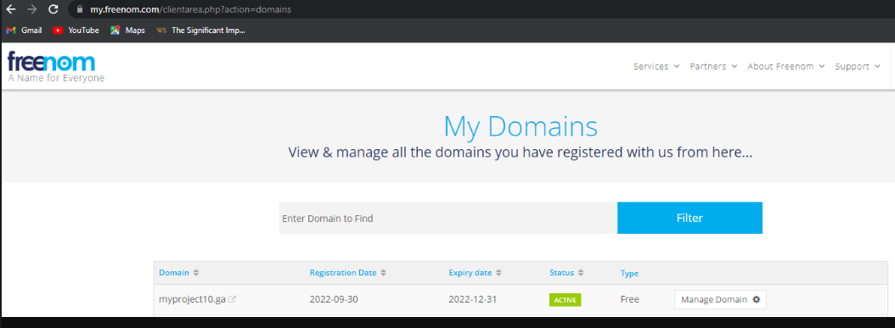
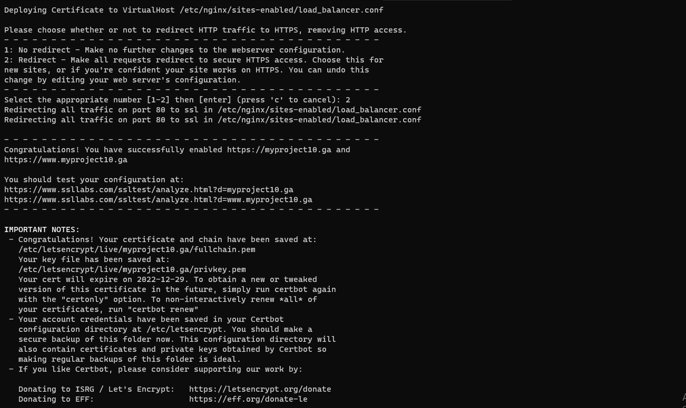

# PECTOR DOCUMENTATION FOR PROJECT 10
- Configure Nginx as a Load Balancer Register a new domain name and configure secured connection using SSL/TLS certificates
first, I configure nginx as a load balancer by Creating an EC2 VM based on Ubuntu Server 20.04 LTS and name it Nginx LB, Update /etc/hosts file for local DNS with Web Servers’ names and their local host address, there after Install and configure Nginx as a load balancer to point traffic to the resolvable DNS names of the webservers using this commands; `sudo apt update`
`sudo apt install nginx` I Configure Nginx LB using Web Servers’ names `sudo vi /etc/nginx/nginx.conf` to check if nginx is running, I ran `sudo systemctl restart nginx`
`sudo systemctl status nginx`
- I later on create a free domain using freenom which after I clicked on Route 53 on my AWS, created an hosted zone. 
I then start my nginx using the command `sudo systemctl enable nginx &&  sudo systemctl start nginx`, then check for the status using this `sudo systemctl status nginx`, 
Created a configuration for your reverse proxy setting. `sudo nano /etc/nginx/sites-available/load_balancer.conf` and I inserted my web information. I used `sudo rm -f` for new reserve proxy, 
chenged directory with `/etc/nginx/sites-enabled` and link your load balancer configuration file to youe sites availabe to that nginx can access it seamlessly. Using this command `sudo ln -s ../sites-available/load_balancer.conf`. Thereafter I reload my Nginx using `nginx with sudo systemctl reload nginx` 
because connection isn't secured I ran `sudo apt install python3-certbot-nginx -y` also `sudo certbot --nginx -d myproject10.ga -d www.myproject10.ga`  

I had a little bit of hard time running the free domain, took me quite a while to get it done.

Thanks